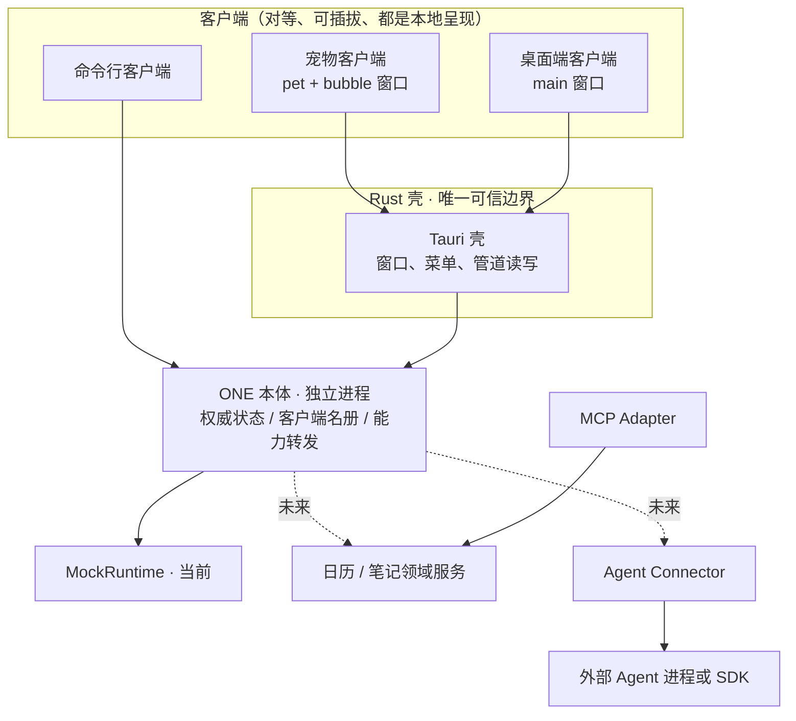

# 系统架构

## 本次落地与长期方向

当前落地：**ONE 本体（core）独立进程 + 两个对等客户端**。本体用 Node 跑 `core/src/index.ts`，在 Windows 命名管道 `\\.\pipe\one-core` 上服务逐行 JSON；宠物与桌面端各自是一个 Tauri 客户端，窗口按客户端种类动态创建，都加载同一份前端；Rust 壳是 webview 与本体之间唯一的可信边界。状态只有一份，在本体里。

尚未落地：真实模型、真实 Agent、数据库、插件加载器、日历笔记界面。回复仍来自内存 MockRuntime。

目标方向不变：Rust/Tauri 负责原生窗口与可信系统能力，TypeScript Runtime 负责会话、运行、上下文投影和能力编排。本地单体加受控外部进程，不做微服务。

## 进程与部署决策（ADR-013 / 014 / 015）

**已实现的形态**。本体持有唯一的会话运行时（ConversationRuntime）与领域端口、权威快照、名册与安装清单。宠物、桌面端、命令行是对等的参与者：连上来、握手声明能力、收状态，彼此没有父子关系。`tauri.conf.json` 不再声明任何窗口，窗口在 `setup` 里按客户端种类创建，因此"默认安装的是宠物，桌面端可选"在架构上成立，而不是靠两个 exe 硬凑。

**参与者有两个正交字段**（ADR-017）：`role` 是纯标签（`pet` / `desktop` / `cli` / `provider`），本体不为它写任何特判；`provider` 是唯一寻址键（`pet` / `local.calendar`），`capability.call.target` 靠它。旧的 `ClientKind` 枚举把三件事塞在一个字段里，于是任何日历提供方来握手都会被当非法帧拒掉 —— 协议层面不允许第三方存在。名册字段也从 `clients` 改为 `participants`，因为呈现形式与领域提供方都能查。

**能力名只说做什么**：以前是 `pet.bubble.open`，认死了"宠物"；现在是 `bubble.open`，由谁提供交给 target 决定。因此宠物和桌面端**声明同名能力**（都有 `window.show`）却不冲突 —— 它们是两个不同的寻址键。名字的唯一真相源在 `wire.ts` 的 `CAPABILITY`，Rust 侧无法 import，改错一边会由 `main.rs` 的字面量测试变红。

- **传输**：Windows 命名管道 + 版本化逐行 JSON，一帧一行，1MB 上限（`packages/contracts/src/wire.ts` 是协议唯一真相源，前后端与本体都从它生成/校验）。不占端口、不需要额外鉴权，同机其他程序也连不上。多客户端不能用 stdio（1 对 1），命名管道是既定选择。
- **能力调用**：客户端之间不直接 spawn。需要请另一个客户端做事时，经本体转发（`capability.call` → `invoke` → `capability.result`），目标由能力名寻址。只有本体知道装了什么（`clients.list` 返回 `installed` 与 `connected`），所以"没装 / 没运行"都能给出明确错误而不是静默失败。0.1 用 `ONE_INSTALLED` 环境变量代替安装器。
- **窗口菜单**：`app.set_menu` 会在每个窗口客户区画一条菜单栏，宠物对话条必须无边框，因此菜单只挂在客户端自己的主窗口上。宠物的右键菜单与窗口菜单共用同一个 `pet_menu()`，避免两处清单走偏（这个坑已经踩过一次：右键只剩"退出"）。

**踩过的坑，改架构时不要退回去**：

- **壳的管道读写不能共用一个文件对象。** 写入句柄是 `File::try_clone()` 出来的，而 Windows 上 `try_clone` 走 `DuplicateHandle` —— 两个句柄指向同一个文件对象，同步 I/O 在文件对象上是串行化的。只要读取线程停在 `ReadFile` 等数据，写端的 `write_all` 就永远排队；而本体在收到第一帧之前不会主动说话，两边互等到死锁。症状是"客户端连上了管道但永远完不成握手"。现在读端用 `PeekNamedPipe` 轮询，没有数据就让出文件对象（`core_link.rs`）。任何新的管道读写代码都必须遵守这一点。
- **Tauri 命令的注册顺序即契约。** `start_bridge` 必须早于 `build_windows`：发布版资源是内嵌的，加载比开发版快得多，桥接晚一步界面就会拿到 `state not managed` 然后整页空白。开发态被 vite 的慢启动掩盖了这个竞态。
- **启动顺序就是用户体验。** `start_bridge` → `start_core` → `build_windows`：先装桥接，再把本体拉起来，最后才摆窗口。本体起来要几百毫秒，先摆窗口的话用户会先看到一个写着"本体未连接"的宠物。
- **拉起本体必须用 `CREATE_NO_WINDOW`。** 客户端是 GUI 子系统，本身不弹控制台；但 `node` 是控制台程序，父进程没有控制台时 Windows 会给它新分配一个，于是每开一次宠物闪一个黑框。日志仍然走 stderr 转发到壳，不受影响。
- **窗口菜单栏（菜单栏）**：只有带标题栏的窗口才挂窗口菜单。`app.set_menu` 会让 Windows 在每个窗口客户区画一条菜单栏，而宠物窗口是无边框透明的，那条菜单栏会一直压在宠物身上，看起来像"背景上有字"。宠物的菜单只以右键弹窗出现，键盘用菜单键 / Shift+F10 走同一条路。桌面端主窗口有正常标题栏，保留菜单栏。
- **一个客户端进程里的多个窗口共用一根管道，也就共用一个会话。** 对话条是宠物的另一块屏幕：它要状态，但壳不给它声明能力（`client_identity` 按窗口返回），因此不会和宠物窗口抢着回答同一个能力调用。
- **发布版必须用 `pnpm desktop:build`。** 直接 `cargo build --release` 不会重新嵌入前端资源，会得到一个打不开的页面。
- **客户端种类有两条通道**：`--client=` 给已构建的 exe，`ONE_CLIENT` 环境变量给 `tauri dev`（Tauri CLI 会把 `--client=pet` 错位传给 cargo）。

**尚未解决**：`R02` 打包。TypeScript 不能直接作为可执行文件分发，而本体现在是靠系统里的 `node` 跑源码。验证目标三元组、体积、杀毒误报、进程清理、SDK 动态依赖；方案定下来前不冻结产物布局。壳启动本体时用 `ONE_REPO_ROOT` → 编译期 `CARGO_MANIFEST_DIR` 向上遍历定位仓库，并在拉起时边跑边转发本体 stderr。

**未来**：真实 Runtime 接入、SQLite 由 Rust 数据服务独占写入、权限与密钥留在可信主机边界，不进前端环境变量。

## 模块职责

| 模块                             | 负责                                 | 不负责                     |
| -------------------------------- | ------------------------------------ | -------------------------- |
| 客户端 UI                        | 渲染、输入、暂存草稿、窗口导航       | 模型密钥、进程启动、数据库 |
| 客户端装配 (`src/lib/client.ts`) | 组装会话运行时、能力实现与领域转发   | 绑定具体传输               |
| 壳 (`src-tauri`)                 | 窗口、菜单、定位、管道读写、进程     | 业务路由与对话文本策略     |
| ONE 本体 (`core`)                | 权威状态、名册、单写入 Run、能力转发 | 窗口与界面                 |
| Session Runtime                  | 对话、Run、事件顺序、单写入约束      | 模型隐藏状态迁移           |
| Context Projector                | 提取历史、摘要、产物与权限范围       | 自动相信工具结果中的指令   |
| Agent Connector                  | start/cancel/resume/能力探测         | 绕过权限访问系统           |
| Domain Service                   | 日程/笔记校验、幂等与版本            | UI 样式与协议解析          |

## 事件与一致性

- 单对话一个活动 Run，不同对话可以独立执行；本体与 Mock 都遵守。
- 持久化事件在事务里分配 conversationId 下严格递增的 seq。
- completed/cancelled/failed 只能写入一次；忽略取消后到达的旧 token。
- Delta 只更新临时草稿；Run 终止时固化已生成文本和终态。
- 客户端断开会清理名册，并作废其他人正在等它回执的请求。
- 对话历史是追加审计流；笔记/日历是可变实体，版本与相关审计事件同事务写入。
- 数据删除最终要物理删除内容或加密密钥，并清理派生缓存；"追加历史"不意味着永久不能删除私人数据。

## 插件策略

领域能力（日历、笔记）是本体外的独立进程，按插件安装（ADR-016）。本体是唯一调用方，负责安装清单、启停与重连，也负责权限裁决；插件自带一份 HTML 页面（ADR-018）。

**页面侧的隔离是硬要求**：

- 页面在沙箱 iframe 里渲染，`sandbox` 只给 `allow-scripts`，**不得给 `allow-same-origin`** —— 同源即意味着页面能读宿主 DOM，隔离作废。
- 页面没有 Node、文件系统与网络；唯一出口是 `postMessage` 给宿主窗口，宿主转发到本体，本体裁决后才回数据。
- 一个插件页面对应一个窗口，窗口与 provider 绑定。宿主不采信页面自报的身份，否则插件之间可以互相冒充。
- 页面由 `one-plugin://<provider>/...` 提供，壳注册自定义协议转交给插件进程响应，不用 localhost HTTP —— 否则要额外处理端口分配、冲突与崩溃回收。
- 当前 CSP `default-src 'self'` 会挡住该协议，实现时必须放开 `frame-src`。

密钥、进程执行与文件权限只在可信主机边界（本体与壳），插件两侧都碰不到。这是「不放在任意插件中」得以成立的机制，不是靠约定。

Wasm 与开放插件市场只有实际需求和安全模型形成后再考虑。
