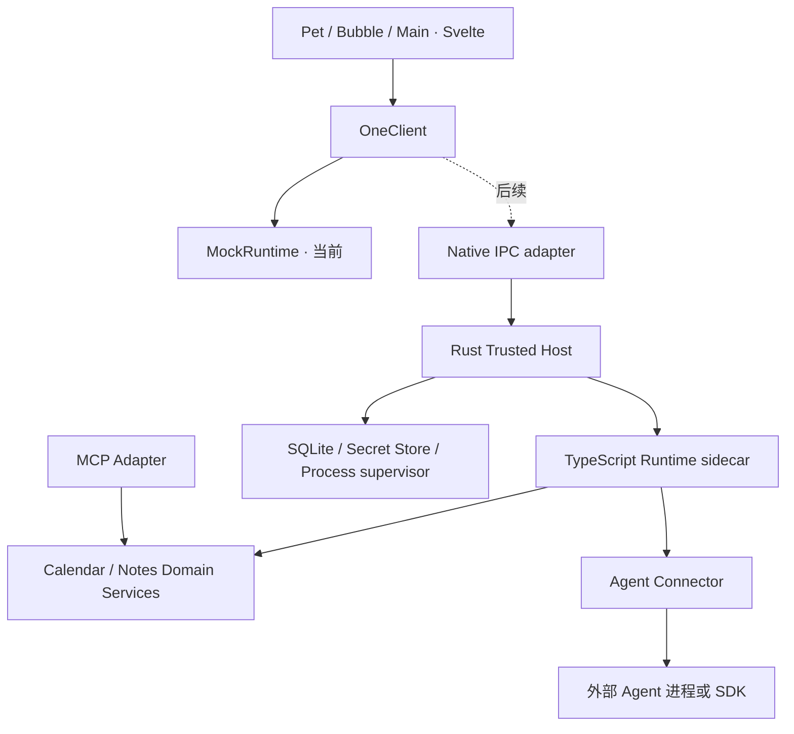

# 系统架构

## 本次落地与长期方向

当前落地：Svelte 5 + TypeScript + Vite；OneClient 与内存 MockRuntime；Tauri v2 的 main / pet / bubble 三窗口；main 窗口内的薄状态代理。无业务后端、数据库、真实模型或插件加载器。

目标方向：Rust/Tauri 负责原生窗口与可信系统能力，TypeScript Runtime 负责会话、运行、上下文投影和能力编排。采用本地单体加受控外部进程，不做微服务。

此图为目标依赖方向；只有 UI/Client/Mock 与壳配置已落地。Tauri WebView 不提供 Node.js Runtime，不能直接在 Svelte 中 import Node 进程或 SDK 代码。

## 进程与部署决策

0.1 单窗口浏览器原型在同一 JS 进程使用内存 MockClient。Tauri 多窗口阶段引入薄 NativeHost 状态代理：主 WebView 保持隐藏存活并持有 MockClient，其他窗口发带 requestId 的命令给主窗口，由主窗口广播带 revision 的快照。新增窗口先请求快照；旧 revision 丢弃；主窗口失效则显示“原型服务不可用”。窗口 ID 和命令白名单由可信壳核验。这是仅供 0.1 的过渡方案，不能直接用于真实 Agent。

**已实现的 0.1 形态**（`src/lib/`）：`client.ts` 是唯一装配点，按窗口标签选择角色——main 窗口持有唯一的 MockClient 并包成 `host.ts`，pet/bubble 得到 `proxy-client.ts`。协议见 `protocol.ts`：命令名白名单、`requestId` 回执、带 `revision` 的快照广播、陈旧 revision 丢弃、8 秒请求超时后标记 `unavailable`，`transport.ts` 让这套逻辑可在无桌面环境单测。与最初设想的差别有三点，均为已知取舍：

- main 窗口同时可见并持有权威状态，而不是"隐藏存活"。宠物与小窗都依赖它，用户看得见反而更容易理解状态归属。
- 窗口操作不经过 JS window API，而是 `invoke` 到 Rust 壳（`tauri.ts` → `main.rs`），由壳决定窗口能做什么。命令名白名单在 host 侧执行，但发送方标签无法在 v2 事件里回溯，因此"身份核验"目前只到命令名层面；出现不可信窗口或插件前必须补齐。
- 每次 token 增量都广播整份快照，这是原型代价；0.2 换sidecar 时必须改成有长度边界的增量帧。

0.2 之后权威状态移入唯一 Runtime sidecar。Rust 启动、监控和终止该进程；用有长度边界的 JSON 消息或逐行 JSON 协议经 stdio 通信，协议日志只走 stderr。要求 requestId、协议版本、超时、帧大小上限、取消与启动握手；不默认暴露本地 HTTP 监听端口。

TypeScript 不能直接作为可执行文件分发。R02 必须做打包实验：比较“携带固定 Node Runtime + 编译 JS”与支持的单文件可执行打包。验证目标三元组、体积、杀毒误报、进程清理、SDK 动态依赖。方案验证成功后再冻结产物布局。Tauri 支持外部二进制的集成方式，见[官方 sidecar 文档](https://tauri.app/develop/sidecar/)。

首版持久化由 Rust 数据服务独占 SQLite 写入，TS 通过受限命令调用，避免两个进程各自维护数据真相。UI 不直接操作数据库。

## 模块职责

| 模块              | 负责                             | 不负责                     |
| ----------------- | -------------------------------- | -------------------------- |
| UI                | 渲染、输入、暂存草稿、窗口导航   | 模型密钥、进程启动、数据库 |
| OneClient         | UI 稳定接口、错误语义、订阅      | 绑定具体 Agent 协议        |
| Session Runtime   | 对话、Run、事件顺序、单写入约束  | 模型隐藏状态迁移           |
| Context Projector | 提取历史、摘要、产物与权限范围   | 自动相信工具结果中的指令   |
| Agent Connector   | start/cancel/resume/能力探测     | 绕过权限访问系统           |
| Domain Service    | 日程/笔记校验、幂等与版本        | UI 样式与协议解析          |
| Native Host       | 窗口、进程、存储、密钥、权限执行 | 业务路由与对话文本策略     |

## 事件与一致性

- 单对话一个活动 Run，不同对话可以独立执行；当前 Mock 已遵守。
- 持久化事件在事务里分配 conversationId 下严格递增的 seq。
- completed/cancelled/failed 只能写入一次；忽略取消后到达的旧 token。
- Delta 只更新临时草稿；Run 终止时固化已生成文本和终态。
- 重启遇到 running 标记为 interrupted（未来状态），不直接再次执行有副作用的工具。
- 对话历史是追加审计流；笔记/日历是可变实体，版本与相关审计事件同事务写入。
- 数据删除最终要物理删除内容或加密密钥，并清理派生缓存；“追加历史”不意味着永久不能删除私人数据。

## 插件策略

先在代码中显式装配官方模块。出现两个真实可替换实现后再抽取 Registry、Lifecycle 和依赖声明。生命周期需有 dispose/取消/解除订阅；加载失败回滚已注册资源。第三方进程隔离不自动等于沙箱，限制能力需要 OS 和 Host 配合。

权限执行、密钥边界、进程监督属于可信核心，不允许扩展自己替换这些服务。Wasm 与市场只有实际需求和安全模型形成后再考虑。
