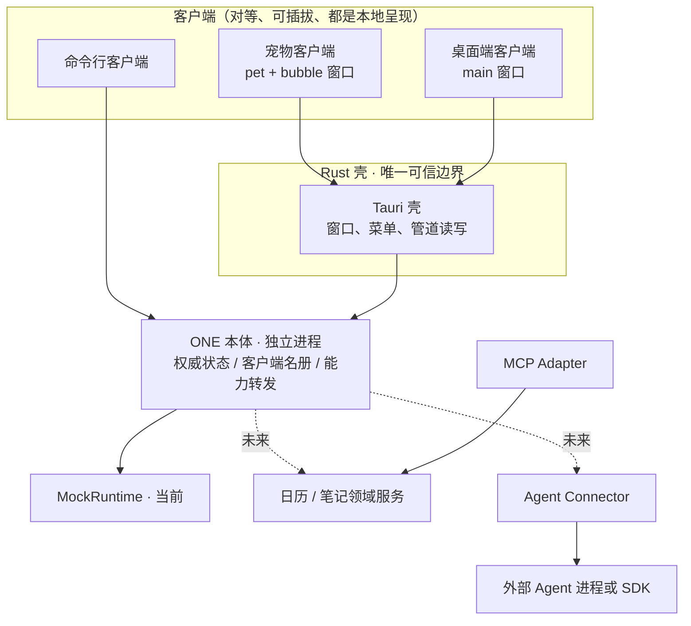

# 系统架构

## 本次落地与长期方向

当前落地：**ONE 本体（core）独立进程 + 两个对等客户端**。本体用 Node 跑 `core/src/index.ts`，在 Windows 命名管道 `\\.\pipe\one-core` 上服务逐行 JSON；宠物与桌面端各自是一个 Tauri 客户端，窗口按客户端种类动态创建，都加载同一份前端；Rust 壳是 webview 与本体之间唯一的可信边界。状态只有一份，在本体里。

尚未落地：真实模型、真实 Agent、数据库、插件加载器、日历笔记界面。回复仍来自内存 MockRuntime。

目标方向不变：Rust/Tauri 负责原生窗口与可信系统能力，TypeScript Runtime 负责会话、运行、上下文投影和能力编排。本地单体加受控外部进程，不做微服务。

## 进程与部署决策（ADR-013 / 014 / 015）

**已实现的形态**。本体持有唯一 `OneClient`、权威快照、客户端名册与安装清单。宠物、桌面端、命令行是对等的客户端：连上来、握手声明能力、收状态，彼此没有父子关系。`tauri.conf.json` 不再声明任何窗口，窗口在 `setup` 里按客户端种类创建，因此"默认安装的是宠物，桌面端可选"在架构上成立，而不是靠两个 exe 硬凑。

- **传输**：Windows 命名管道 + 版本化逐行 JSON，一帧一行，1MB 上限（`packages/contracts/src/wire.ts` 是协议唯一真相源，前后端与本体都从它生成/校验）。不占端口、不需要额外鉴权，同机其他程序也连不上。多客户端不能用 stdio（1 对 1），命名管道是既定选择。
- **能力调用**：客户端之间不直接 spawn。需要请另一个客户端做事时，经本体转发（`capability.call` → `invoke` → `capability.result`），目标由能力名寻址。只有本体知道装了什么（`clients.list` 返回 `installed` 与 `connected`），所以"没装 / 没运行"都能给出明确错误而不是静默失败。0.1 用 `ONE_INSTALLED` 环境变量代替安装器。
- **窗口菜单**：`app.set_menu` 会在每个窗口客户区画一条菜单栏，宠物对话条必须无边框，因此菜单只挂在客户端自己的主窗口上。宠物的右键菜单与窗口菜单共用同一个 `pet_menu()`，避免两处清单走偏（这个坑已经踩过一次：右键只剩"退出"）。

**踩过的坑，改架构时不要退回去**：

- **壳的管道读写不能共用一个文件对象。** 写入句柄是 `File::try_clone()` 出来的，而 Windows 上 `try_clone` 走 `DuplicateHandle` —— 两个句柄指向同一个文件对象，同步 I/O 在文件对象上是串行化的。只要读取线程停在 `ReadFile` 等数据，写端的 `write_all` 就永远排队；而本体在收到第一帧之前不会主动说话，两边互等到死锁。症状是"客户端连上了管道但永远完不成握手"。现在读端用 `PeekNamedPipe` 轮询，没有数据就让出文件对象（`core_link.rs`）。任何新的管道读写代码都必须遵守这一点。
- **Tauri 命令的注册顺序即契约。** `start_bridge` 必须早于 `build_windows`：发布版资源是内嵌的，加载比开发版快得多，桥接晚一步界面就会拿到 `state not managed` 然后整页空白。开发态被 vite 的慢启动掩盖了这个竞态。
- **发布版必须用 `pnpm desktop:build`。** 直接 `cargo build --release` 不会重新嵌入前端资源，会得到一个打不开的页面。
- **客户端种类有两条通道**：`--client=` 给已构建的 exe，`ONE_CLIENT` 环境变量给 `tauri dev`（Tauri CLI 会把 `--client=pet` 错位传给 cargo）。

**尚未解决**：`R02` 打包。TypeScript 不能直接作为可执行文件分发，而本体现在是靠系统里的 `node` 跑源码。验证目标三元组、体积、杀毒误报、进程清理、SDK 动态依赖；方案定下来前不冻结产物布局。壳启动本体时用 `ONE_REPO_ROOT` → 编译期 `CARGO_MANIFEST_DIR` 向上遍历定位仓库，并在拉起时边跑边转发本体 stderr。

**未来**：真实 Runtime 接入、SQLite 由 Rust 数据服务独占写入、权限与密钥留在可信主机边界，不进前端环境变量。

## 模块职责

| 模块                             | 负责                                 | 不负责                     |
| -------------------------------- | ------------------------------------ | -------------------------- |
| 客户端 UI                        | 渲染、输入、暂存草稿、窗口导航       | 模型密钥、进程启动、数据库 |
| 客户端装配 (`src/lib/client.ts`) | 组装 OneClient 与能力实现            | 绑定具体传输               |
| 壳 (`src-tauri`)                 | 窗口、菜单、定位、管道读写、进程     | 业务路由与对话文本策略     |
| ONE 本体 (`core`)                | 权威状态、名册、单写入 Run、能力转发 | 窗口与界面                 |
| Session Runtime                  | 对话、Run、事件顺序、单写入约束      | 模型隐藏状态迁移           |
| Context Projector                | 提取历史、摘要、产物与权限范围       | 自动相信工具结果中的指令   |
| Agent Connector                  | start/cancel/resume/能力探测         | 绕过权限访问系统           |
| Domain Service                   | 日程/笔记校验、幂等与版本            | UI 样式与协议解析          |

## 事件与一致性

- 单对话一个活动 Run，不同对话可以独立执行；本体与 Mock 都遵守。
- 持久化事件在事务里分配 conversationId 下严格递增的 seq。
- completed/cancelled/failed 只能写入一次；忽略取消后到达的旧 token。
- Delta 只更新临时草稿；Run 终止时固化已生成文本和终态。
- 客户端断开会清理名册，并作废其他人正在等它回执的请求。
- 对话历史是追加审计流；笔记/日历是可变实体，版本与相关审计事件同事务写入。
- 数据删除最终要物理删除内容或加密密钥，并清理派生缓存；"追加历史"不意味着永久不能删除私人数据。

## 插件策略

先在代码中显式装配官方模块。出现两个真实可替换实现后再抽取 Registry、Lifecycle 和依赖声明。生命周期需有 dispose/取消/解除订阅；加载失败回滚已注册资源。第三方进程隔离不自动等于沙箱，限制能力需要 OS 和 Host 配合。

权限执行、密钥边界、进程监督属于可信核心，不允许扩展自己替换这些服务。Wasm 与市场只有实际需求和安全模型形成后再考虑。
