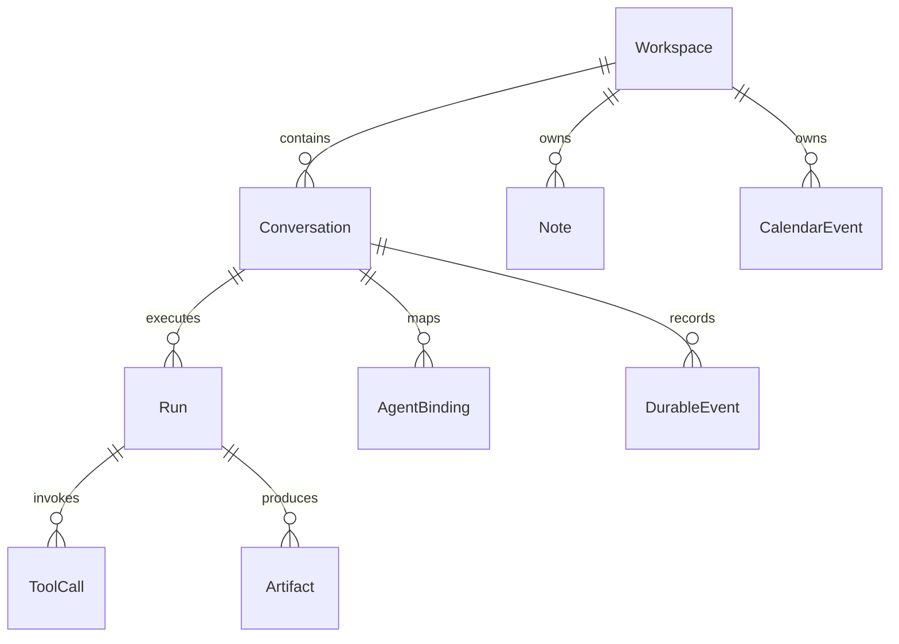

# 数据模型与接口契约

## 命名与范围

统一用 Conversation 表示用户的一条对话；Session 只在泛称或外部 externalSessionId 中使用。Workspace 是环境与数据归属，Run 是某个 Agent 的一次执行，AgentBinding 是对话与外部 Agent 会话的映射。

聊天类型位于 `packages/contracts/src/index.ts`，错误码在 `errors.ts`，日历与笔记契约及其运行时校验在 `domain.ts`。下列 Artifact、ToolCall、权限和存储定义仍是下一阶段的设计，不代表已有 API。

## 核心对象

| 对象                        | 必要字段                                                                           | 约束                                       |
| --------------------------- | ---------------------------------------------------------------------------------- | ------------------------------------------ |
| Workspace                   | id, name, rootUri?                                                                 | 个人空间可以没有文件目录；文件访问另需授权 |
| Conversation                | id, workspaceId, title, agentId, createdAt                                         | 不随 Agent 切换而改变 id                   |
| Run                         | id, conversationId, agentId, status                                                | agentId 在运行期间不可变                   |
| AgentBinding                | id, conversationId, agentId, externalSessionId?, lastProjectedSeq                  | provider/session 版本与有效性探测后续增加  |
| DurableEvent                | id, schemaVersion, conversationId, seq, createdAt, type, payload                   | seq 在对话内唯一递增，类型可判别           |
| Note（已实现类型）          | id, workspaceId, title, body, version, sourceConversationId?, createdAt, updatedAt | 乐观锁冲突不覆盖                           |
| CalendarEvent（已实现类型） | id, workspaceId, title, startsAt, endsAt, timeZone, version, sourceConversationId? | endsAt > startsAt；时区用 IANA 名称        |
| Artifact（计划）            | id, runId, uri, mimeType, digest, createdAt                                        | 内容存在受控文件目录，引用校验与权限检查   |
| ToolCall（计划）            | id, runId, name, args, idempotencyKey, status, result?                             | 敏感参数脱敏；实际效果必须可审计           |

消息和 Agent 切换目前位于事件的判别联合中，并非通用 `payload: any`。日期以带偏移的 RFC3339/ISO 时间存储；显示按用户时区转换。全天日程以后用单独的日期字段，避免强行按午夜 UTC 表示。

## 已实现：会话运行时（ConversationRuntime）

会话、Agent、Run 全在这一层，与领域能力无关。原 `OneClient` 同时挂着日历与笔记命令，换一个日历实现就等于把会话状态机一起换掉，因此已按 ADR-016 拆开。

| 方法               | 输入 / 输出                               | 语义                                   |
| ------------------ | ----------------------------------------- | -------------------------------------- |
| getSnapshot        | → Snapshot                                | 同步返回副本，调用方修改不影响内部状态 |
| subscribe          | callback → unsubscribe                    | 订阅快照变化，第一次由调用方读取       |
| createConversation | title? → Conversation                     | 个人空间创建，默认 Chat Agent          |
| changeAgent        | conversationId, agentId → void            | 运行中 BUSY，同 Agent 为无操作         |
| sendMessage        | conversationId, text → Run                | 先提交用户消息与启动事件，再模拟回复   |
| cancelRun          | runId → void                              | 已结束则无操作；未知 Run 为 NOT_FOUND  |
| settleProposal     | proposalId, ProposalResolution → Proposal | 本体写回处理结果；重复处理 CONFLICT    |
| dispose            | → void                                    | 释放计时器与订阅，调用方不再使用该实例 |

`Snapshot` **不再含** `notes` / `calendarEvents`：领域数据归提供方，挂在会话快照里意味着每次广播都捎带一次全量日历。

`Snapshot` **含** `proposals`：待确认与已解决的提议。这不违反上一条 —— **提议还不是领域数据**，它是一句「打算写什么」；落库之后本体就把它解决掉（`proposal.settled`），实体仍然只在提供方那里。

## 已实现：领域端口（CalendarProvider / NotesProvider）

`packages/contracts/src/provider.ts`。本体是唯一调用方；宠物、桌面端、命令行经本体的 `domains` 转发调用（见 `src/lib/core-link.ts`）。

端口签名的输入是**已解析类型**（`CalendarCreateInput`、`NormalizedCalendarListInput` 等），不再是 `unknown`。校验只在本体边界发生一次，由 `domain.ts` 的 `parseXxx` 完成；提供方收到的一定是可信输入，它自己不再校验。这样「谁负责校验」收敛到唯一一处，换实现时不会漏也不会重复。未在白名单内的命令在本体侧直接拒绝。

四类不可用必须彼此可分，`resolveProvider` 统一翻译（ADR-016）：

| 情况         | code                | details.providerProblem.reason                            |
| ------------ | ------------------- | --------------------------------------------------------- |
| 根本没安装   | `UNAVAILABLE`       | `not-installed`（附带怎么装的引导）                       |
| 装了但没运行 | `UNAVAILABLE`       | `not-running`（说的是连接不上，不是功能不存在）           |
| 装了但没授权 | `PERMISSION_DENIED` | `not-authorized`，`missing` 列出缺哪几项权限              |
| 版本对不上   | `CONFLICT`          | `version-conflict`，带 `providerVersion` 与 `coreVersion` |

`reason` 是结构化的，文案会改它不会；界面靠它分流，不靠解析中文字符串。命令派发顺序是**先解析提供方、再校验输入**：提供方不可用时校验参数没有意义，报 VALIDATION 反而误导。

`ClientError` 的 code：VALIDATION、NOT_FOUND、BUSY、DISPOSED、CONFLICT、UNAVAILABLE、PERMISSION_DENIED、TIMEOUT、INTERNAL。RATE_LIMITED 仍待真实适配层能抛出时再加。

**接口演进约束**：当前 getSnapshot 同步是 UI 本地缓存接口。未来 IPC Client 要先异步握手加载缓存，再进入 ready；网络请求不得伪装成同步读取。扩展 `connect()/connectionState` 时一起更新 Mock 和契约测试，不承诺完全无需改 UI。

## 已实现：插件页面契约（ADR-018）

`packages/contracts/src/page.ts`。协议标记 `one.plugin.v1`，页面与宿主之间只有 `postMessage` 一条路。

| 消息         | 字段                                                            | 谁发        | 说明                                                 |
| ------------ | --------------------------------------------------------------- | ----------- | ---------------------------------------------------- |
| PageRequest  | `protocol, id, capability, args`                                | 页面 → 宿主 | `capability` 是能力名（`calendar.list`），不是命令名 |
| PageResponse | `protocol, id, ok, value? / message? / code? / currentVersion?` | 宿主 → 页面 | 失败必须给 `message`，不许用空结果冒充成功           |

四条不能省的约束：

- **能力名 → 命令名由宿主翻译**（`PAGE_DOMAIN_COMMANDS`）。`calendar.remove` 对应的本体命令是 `calendarDelete`，靠改写字符串得到的是另一个不存在的命令；而且翻译之后输入会**再过一次本体边界的校验**（ADR-016），直接按能力名转发会绕过那一次。
- **页面没有身份字段。** 上下文 `workspaceId` / `source` 由宿主补，页面报了也不作数。宿主靠**窗口绑定**知道这个窗口属于哪个提供方（ADR-018 第 3 条）。
- **页面路径受守卫**（`isPagePath`）：相对、无 `..`、无反斜杠，入口非法就当没申报 —— 宿主会把它拼进 `one-plugin://` 地址，坏路径必须在协议解析那一层挡住。
- **页面提交操作不用 `<form>`。** 沙箱 iframe 只有 `allow-scripts`（ADR-018 第 5 条），`submit` 事件根本不会触发，按钮会静默失灵。契约上页面能做的事没变（`postMessage` + 能力名），变的只是页面自己怎么把「用户点了」翻译成一次 `ask()`。

失败回执上的 `code` 与 `currentVersion` 是后加的两个可选字段：少了 `code`，「这条被别人改过了」与「日历源没连上」在页面上长得一模一样，而这两件事要给的界面完全不同（前者要留住用户打的字，后者只提示重试）；少了 `currentVersion`，界面只能说「被改过了」而给不出对方现在是第几版，用户没法决定是放弃自己那份还是再看一眼。`currentVersion` 只在 `code` 是 `CONFLICT` 且值是数字时才给，不猜。

**这两个字段要能从本体一路走到页面，中间一站都不能少**：`ClientError.details.currentVersion` → 提供方 `capability.result` 的 `details` → 本体还原 `ClientError` → `result.error.details` → 页面回执。这里曾经断了一环（ADR-024），断的时候没有任何一方报错，界面只是安静地显示一个问号。

协议本身随 wire v3 走：参与者在 `hello.client.view` 里申报入口，宿主用 `page.read` 向本体要资源。**为什么升版本而不是加个可选字段**：v2 的本体会静默丢掉这个字段，于是页面永远打不开而没有任何一方报错 —— 那正是版本守卫要挡住的情况。

## 已实现：摘要条契约（ADR-019）

摘要条**不新增任何协议**。它只用三样已存在的东西，这是有意的 —— 四态与在场判断本来就该由本体和名册表达，界面自己发明一套只会多一处能说谎的地方。

| 用到的                           | 从哪来                                         | 摘要条拿它做什么               |
| -------------------------------- | ---------------------------------------------- | ------------------------------ |
| `call` 命令帧                    | `calendarList` / `notesList`（已有白名单命令） | 经本体取数，不自己连提供方     |
| `details.providerProblem.reason` | 领域调用失败时的结构化原因（已有）             | 四态分流，不解析中文字符串     |
| `roster.connected[].view`        | 名册里自带页面的申报（v3 已有）                | 判定「打开××页面」按钮能不能点 |
| `state.revision`                 | 本体每帧状态带的版本号（已有）                 | 摘要底下写「本体状态 #7」      |

`CoreClient.revision()` 是新增的**读取口**（没收到过状态帧时是 `-1`，不是 `0`）。`client_identity.summaryExpanded` 也是新增的**询问**：展开与否由窗口高度决定，高度只有壳知道，界面不自己记一份。

## 已实现：提议契约（ADR-022）

`packages/contracts/src/proposal.ts`。协议版本因此升到 **wire v4**。

| 命令                  | 入参                              | 出参                       | 边界上的行为                                                                                 |
| --------------------- | --------------------------------- | -------------------------- | -------------------------------------------------------------------------------------------- |
| `proposalResolve`     | `{proposalId, decision, reason?}` | `ProposalResolution`       | 不存在为 NOT_FOUND；**已解决过的返回既有结果**且 `applied:false`；`reject` 必须带非空 reason |
| `listProposals`       | —                                 | 摘要列表                   | 读的是同一份状态，命令行与排障用                                                             |
| `conversationHistory` | conversationId                    | `{conversation, messages}` | 不存在为 NOT_FOUND；按时间顺序返回 `{role, content}`，无头验收读回复用                       |

`proposalResolve` **按 `proposal.domain` 分派**：日历走 `parseCalendarCreate` + `calendar` 端口，笔记走 `parseNotesCreate` + `notes` 端口。写成一律走日历的话，一条笔记提议会被静默写成日程 —— 字段对不上，提供方要么报错要么写出一条空标题日程，而用户看到的是「成功」。工作区取自**提议自己**而不是客户端上报的值。

| 类型                 | 作用                                                                               |
| -------------------- | ---------------------------------------------------------------------------------- |
| `Proposal`           | 判别联合（`domain: 'calendar' \| 'notes'`），带 `status` 与两处结果字段            |
| `ProposalDraft`      | 日程草稿**不含幂等键**——键由提议 id 派生                                           |
| `ProposalResolution` | `applied` 是这里唯一需要解释的字段：重复确认时为 `false`，界面据此说「已经建过了」 |

四条随形状一起定下的规矩：

1. **幂等键由提议 id 派生，不接受外部指定。** 「重复确认不重复创建」靠调用方传对键只是一句约定；派生之后它是结构性的。
2. **提议只描述意图，不复制领域实体**，但带 `sourceConversationId` —— 「这条日程是哪句话来的」必须答得出来。
3. **认不出就说认不出。** 日程草稿靠一张中文句式表（`packages/mock-runtime/src/schedule.ts`），失败时返回一句能直接说给用户听的话，而不是塞一个看起来合理的时间。
4. **解决一次就定了。** 要改主意就在聊天里再说一遍，那会是一条新提议；这条换掉的是「已经创建的提议再点拒绝」那条撒谎的路。

**为什么升版本而不是加可选字段**：v3 的本体会**静默丢掉**提议，界面上的「确认」按钮点下去永远没有回音 —— 用户看到的是一张装点门面的卡片，比没有更糟。这与 v2→v3 加 `view` 是同一条理由。Rust 侧 `main.rs` 的 `WIRE_VERSION` 与 `wire.ts` 各有一份，靠一条会去读那个文件的 Rust 测试防漂移。

卡片上的时间**直接拆 RFC3339 字符串**，不走 `Date` 的本地化 —— 那串字符里的 `+08:00` 就是提议声明的那个墙上时间；拿 `getHours()` 读，读到的是**这台机器**的时区。

**摘要条是只读窗口但会发命令**：`windowRole: 'view'`，不握手、走 `core_replay` 拿状态与名册，取数仍走正常的 `call` 帧。`core_replay` 只重放 `welcome` / `state` / `roster` 三帧，命令回执绝不重放。

**工作区键与插件页面共用**（`summaryCommandContext` 与 `pageCommandContext` 都退回 `personal`）：同一个键，否则同一条日程会在命令行、插件页面、摘要条三处各存一份。

## 已实现：壳发往本体的帧

壳是 Rust，协议的真相源是 `packages/contracts/src/wire.ts`，**两边没有编译期联系**。壳发往本体的帧因此全部收在 `src-tauri/src/frames.rs`，并由两条测试钉住字段集。

这条规矩是被实机逼出来的：壳发 `clients.launch` 时把 `provider` 写成了 `kind`，本体按不可信输入解析 → `parseClientMessage` 返回 `null` → 日志「收到无法解析的帧」→ **并把整根管道踢掉**。用户点「打开 ONE 桌面端」什么都没发生，而菜单里的那一项看着完全正常。帧散落在 `main.rs` 与 `plugin.rs` 各处时就一定会出这种错，两边都没有编译器拦它。

| 帧                | 关键字段                      | 用途                                           |
| ----------------- | ----------------------------- | ---------------------------------------------- |
| `hello`           | `client: {role, provider, …}` | 每个窗口一个身份；对话条不申报能力             |
| `clients.launch`  | `provider`                    | 请本体拉起某个寻址键（客户端之间不 spawn）     |
| `clients.list`    | —                             | 问「装了什么、谁在跑」；菜单只给点了能开的入口 |
| `capability.call` | `capability, target, args`    | 跨窗口请另一个客户端做事                       |
| `page.read`       | `provider, path`              | 取插件页面 HTML                                |

`clients.launch` 的字段名与 `hello.client.provider` **必须是同一个词** —— 寻址键在三处（`hello`、`clients.launch`、命令行）各写一遍，改一处不改另一处就是一次「点了没反应」。

## 下一步领域命令草案

统一命令信封：`{ requestId, workspaceId, source: 'ui' | 'agent', runId?, expectedVersion?, input }`。修改命令接受 idempotencyKey；命令来源在可信边界标记，不相信客户端自报权限。

| 命令            | 核心输入                                           | 输出 / 校验                       |
| --------------- | -------------------------------------------------- | --------------------------------- |
| calendar.list   | rangeStart, rangeEnd, timeZone                     | 范围内条目，分页游标              |
| calendar.create | title, startsAt, endsAt, timeZone, idempotencyKey  | CalendarEvent；时间有效、时长为正 |
| calendar.update | id, expectedVersion, patch, idempotencyKey         | 新版本；冲突返回 CONFLICT         |
| calendar.delete | id, expectedVersion, idempotencyKey                | 删除结果与审计引用                |
| notes.list      | query?, cursor?, limit                             | 摘要列表，不默认加载全部正文      |
| notes.get       | id                                                 | 单条全文                          |
| notes.create    | title, body, sourceConversationId?, idempotencyKey | Note                              |
| notes.update    | id, expectedVersion, patch, idempotencyKey         | Note 新版本                       |
| notes.delete    | id, expectedVersion, idempotencyKey                | 删除结果                          |

P03 把此草案写成 TypeScript 类型和运行时校验 schema。TypeScript 只负责编译期，IPC/MCP 输入必须在入口做运行时校验。UI 与 MCP 都调用同一领域方法，时间校验和幂等规则不能复制两套。

已实现：输入 schema 拒绝未知字段、要求带偏移的 RFC3339 时间、校验 IANA 时区与正时长；幂等以 `(workspaceId, idempotencyKey)` 为键保存请求摘要与结果，同键同输入回放原结果、同键异输入报 CONFLICT。笔记列表只返回摘要，正文不默认加载。删除返回 `auditRef`，0.1 的审计条目仅存在内存中。

`notes.get` 不是给日历也补一遍的冗余：日历的列表本来就返回完整实体，而笔记列表按契约剥掉正文，没有 `get` 就没法编辑一条笔记。能力按域分开申报（`CALENDAR_ACTIONS` / `NOTES_ACTIONS`），共用一张表会让「给笔记加 get」同时要求日历也提供 get，日历没有就会被判成「没授权」——那是两种完全不同的失败。

## 事件与 Run 状态

当前 durable：message.created、agent.changed、run.started、run.finished。当前 token 增量体现在 Snapshot.drafts；EphemeralEvent 类型预留，尚未提供独立事件订阅接口。

后续 durable：tool.requested、permission.resolved、tool.completed/failed、artifact.created、conversation.summarized。后续 ephemeral：message.delta、progress、typing、stdout.delta（有缓冲上限）。不收集隐藏 chain-of-thought。

目标 Run：queued → running ↔ awaiting_permission → completed / cancelled / failed / interrupted。当前 Mock 只用 running/completed/cancelled；failed 类型保留待故障模拟。终态不能回到 running；重试创建新 Run，并用 retryOf 关联旧 Run。

## 持久化计划（0.2）

SQLite 表：workspaces、conversations、runs、agent_bindings、conversation_events、notes、calendar_events、artifacts、command_receipts、schema_migrations。

- conversation_events 唯一索引 `(conversation_id, seq)`；外键开启；同事务写投影与事件。
- command_receipts 唯一 `(workspace_id, idempotency_key)`，保存请求摘要与结果；同键不同请求拒绝。
- 笔记和日程用 version 做并发控制；runs 加 status 与更新时间索引。
- 不在大历史中重复存二进制文件；附件放应用数据目录，用摘要关联。
- 数据位置由平台 appDataDir 获取，不写代码仓库；迁移前备份、失败回滚。
- v1 导出 JSON 带 schemaVersion 和相对附件路径；导入校验大小、路径穿越和未知字段。
- 自动摘要不覆盖原消息；记录生成范围与来源 seq。用户可纠正摘要。

**已实现（R01，ADR-027）**：上面十张表里的五张已经在 `<数据目录>/local.db` 里 —— `notes`、`calendar_events`、`audit_entries`、`command_receipts`、`schema_migrations`。库用 `node:sqlite` 开，**不加任何依赖**；`journal_mode=WAL` + `synchronous=FULL` + `foreign_keys=ON` + `busy_timeout=5000`。两条约束已经落成声明式的：版本守卫写进 `UPDATE … WHERE version = ?`，幂等回执的**唯一约束在主键上** `(workspace_id, idempotency_key)`。0.1 的两个 JSON 文件由迁移 v2 导入，**原文件一个字节都不动**，成功后改名成 `.migrated`；坏文件让整次迁移失败而不是静默导空。

**没实现的**：`workspaces`、`conversations`、`runs`、`agent_bindings`、`conversation_events`、`artifacts` 六张表**还没建**，它们归 R03（会话运行时持久化）。所以「同事务写投影与事件」这条目前只有日历与笔记这一半，事件侧要等 R03。`dataDir()` 的优先级是 `ONE_DATA_DIR` > `%APPDATA%\ONE\data`。
